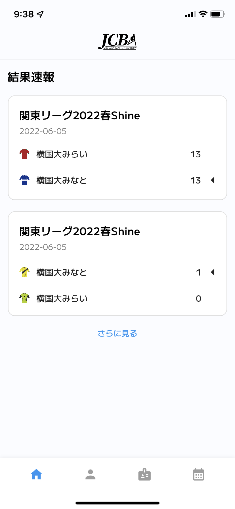

<h1>JCBA 公式アプリ</h1>

<!-- ABOUT THE PROJECT -->
## このプロジェクトについて
[日本キャップ野球協会](https://kantoregioncapbase.wixsite.com/website) の公式アプリ（プロトタイプ）です。 

以下のパブリックリンクから、TestFlight経由でアプリをダウンロードできます。 

URL: https://testflight.apple.com/join/iXFbMXQu

(<a href="#top">back to top</a>)

## 使用技術
* [Flutter](https://flutter.dev)
* [Firebase Authentication](https://firebase.google.com/docs/auth)（会員登録 & ログイン機能）
* [Cloud Firestore](https://firebase.google.com/docs/firestore)（ユーザー情報の管理DB）
* 選手・試合結果などの情報は、[キャップ野球情報局](https://cap-baseball.com)のAPIから取得

(<a href="#top">back to top</a>)

## スクリーンショット

  
  
  
  
  
  

(<a href="#top">back to top</a>)

<!-- ROADMAP -->
## 機能の実装状況

- [x] 試合速報
- [x] 全チームの一覧
- [x] 選手情報の詳細
- [x] ユーザー登録 & ログイン
- [x] 会員証表示
- [ ] 試合の登録 & 出場管理

(<a href="#top">back to top</a>)

